# Planisphere

**Where Every Event Find its Orbit**

## Table of Contents

- [Description](#description)
- [Features](#features)
- [Technologies Used](#technologies-used)
- [Process](#process)
- [Future Development](#future-development)
- [License](#license)
- [Authors](#authors)
- [Credits](#credits)
- [Links](#links)

## Description
Planishpere is a comprehensive event planning application designed to help users organize and manage events seamlessley. Whethere it's a birthday party, wedding, graduation, or any other special occasionan, Planisphere offers an intuitve platform to organize venues, budget, and track tasks for your events. 

## Features
- **User Authentication:** Secure user registration and login using JWT
- **Event Management:** Create, update, delete, and view events.
- **Budget Tracking:** Tool to manage event finances
- **Venue Management:** Utilizes Google API to help user browse and secure an event space
- **Responsive Design:** App is responsive on mobile using Chakra UI

## Technologies Used
- **Frontend:**
  - React
  - CSS Styling: Chakra UI
- **Backend:**
  - Node.js
  - Express.js
  - GraphQL
  - MongoDB
  - Mongoose
- **Authentication:**
  - JWT
- **Deployment:**
  - Deployment with Render

## Process
See below for our process in builing Planisphere. 

### Wireframe
Our project started with a wireframe, outlining the initial design elements including headers, navigation, login/logout functionality, event tabs, and a footer. 

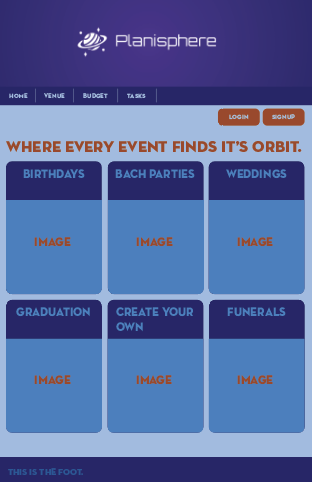

### Development Phases: 

**User Story**
As a user, I need to plan an event.

I want a single place to organize my event,

So that I can organize my thoughts and keep track of venue, budget, and tasks. 

Given an event planner site,
When I log into the site,
Then I am shown my home page w/ my events.

When I click to add an event,
Then I am presented with a page to get started.

When I go to organize my tasks,
Then I am apple to go to a separate area for setting tasks.

When I need to sort my budget,
Then I go to the budget section to set and manage my expenses or tasks.

When I need to find a venue,
Then I can look at multiple venues to choose from.

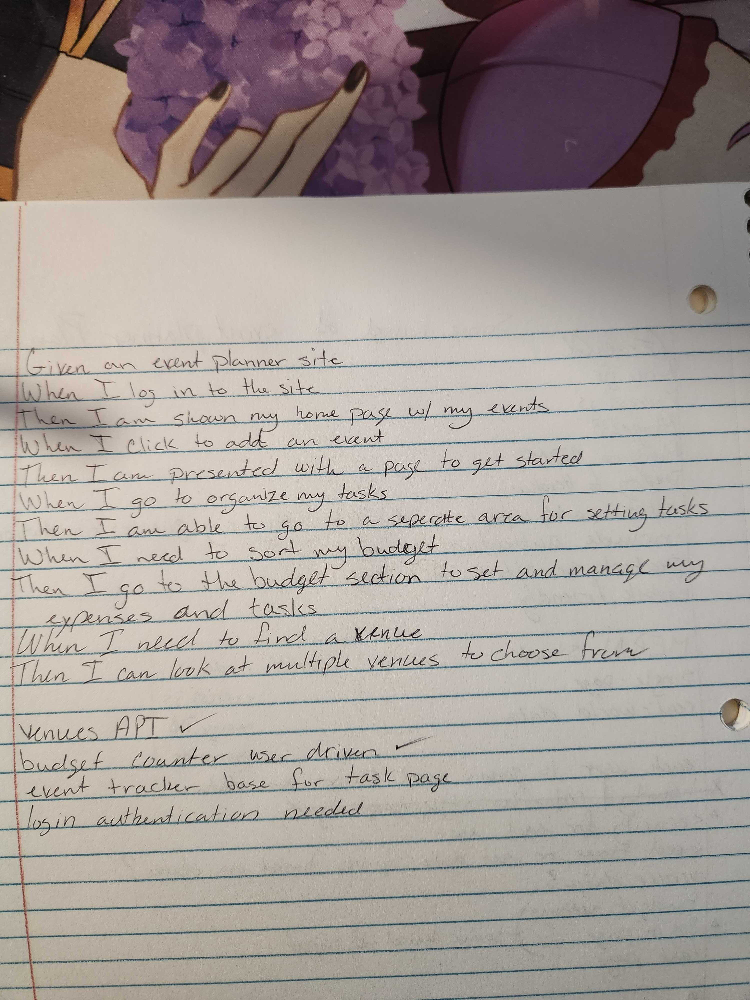)

**Visual Elements**
See the screenshots below showcasing our wireframe, process to decide aesthetics, color palettes, and preliminary logos, user interfaces during various development stages, encountered errors, and the final product. 

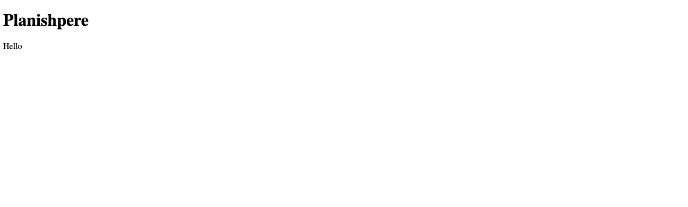

Fun choosing images for the Home page:

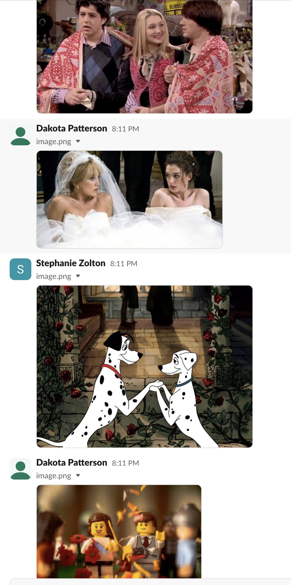

Color palettes:

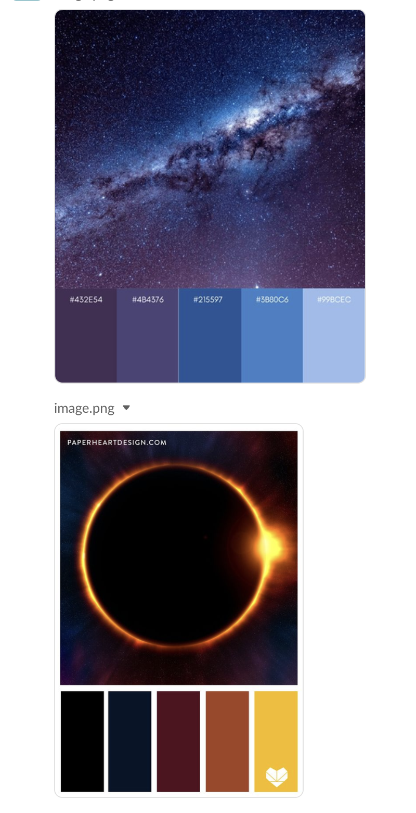

Inspirational logo:

Images added to Home page; adjusted to be within frame of box + responsive

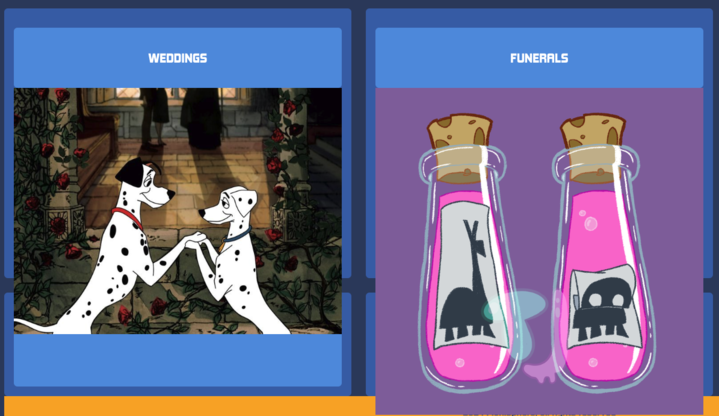

**Home page, finalized product: WEBPAGE**

**Home page, finalized product: MOBILE**

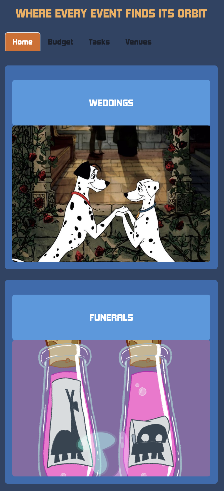

Our group struggled with errors as shown below that hindered the deployment process:

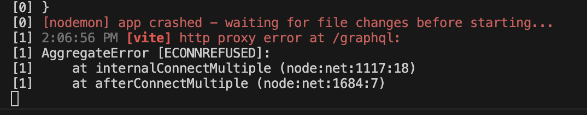

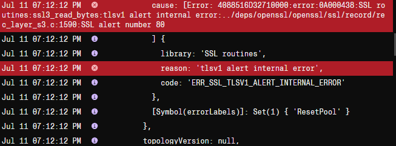

Find a venue using Google API:

(Image coming soon)

Create a To-Do list with the Task Page:

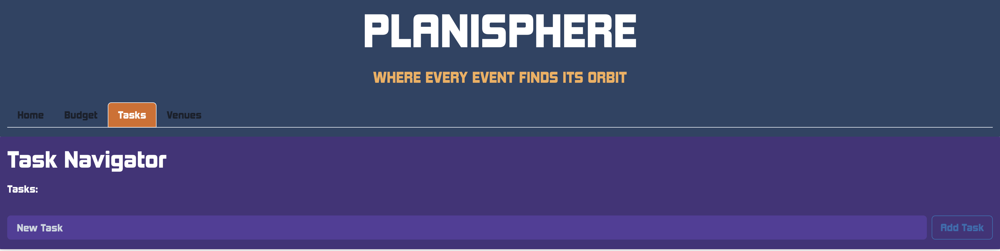

Financially plan your trip with the Budget Page:

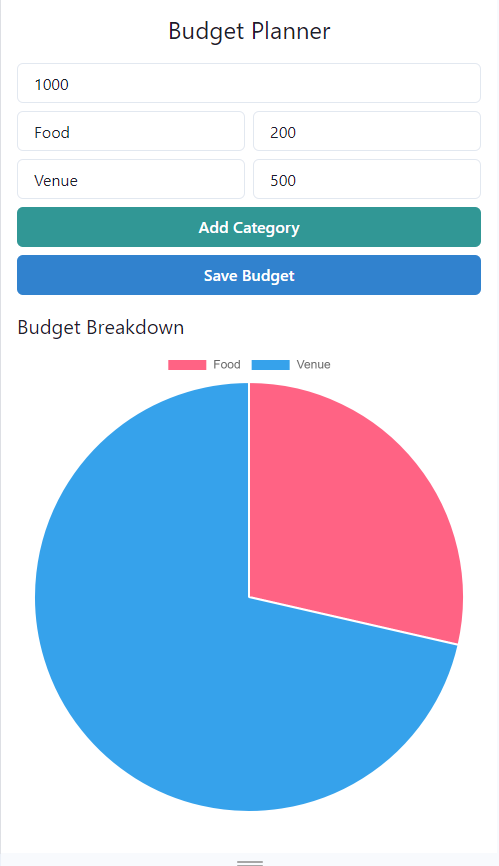

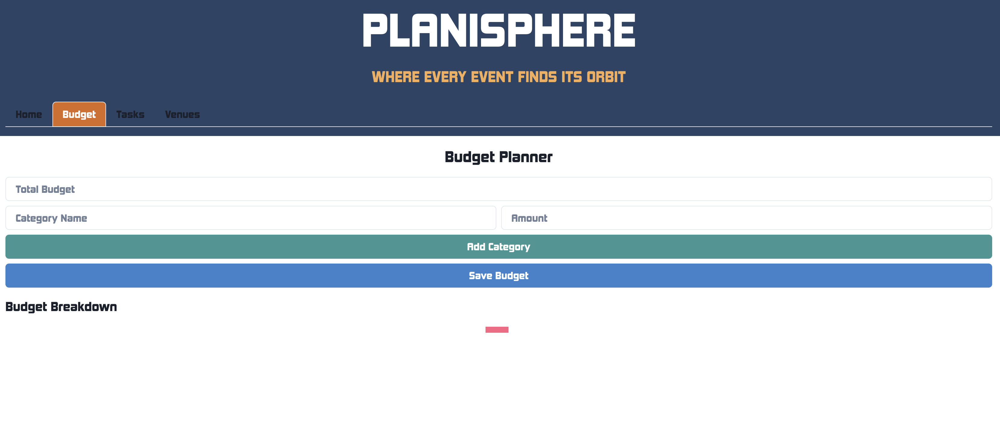

Event tabs take you to a venue specific ot that event: 

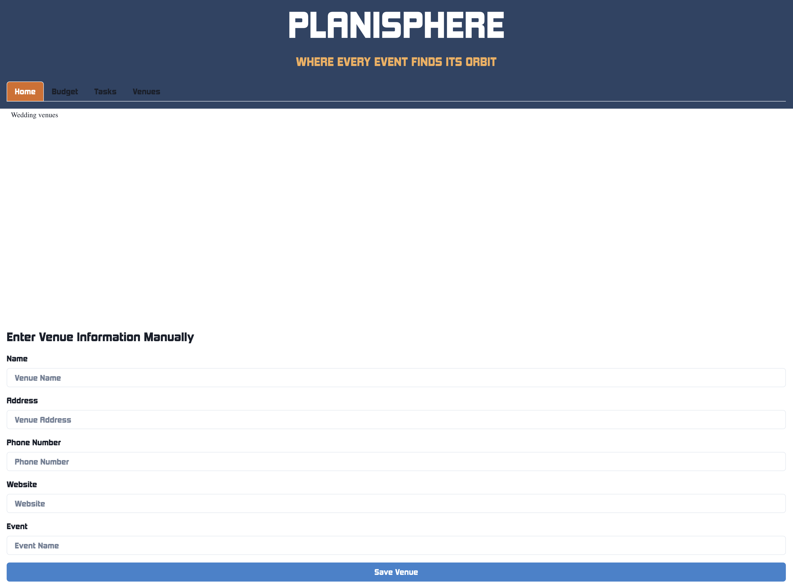

## Future Development
For future development, we wanted to create additional features such as:
- **PWA Conversion**: Continue to develop Planisphere as a progressive web application for enhanced local usability
- **Payment Integration**: Incorporate Stripe for seamless financial transactions
- **Expanded Vendor Services**: Enable users to contact and book essential services including but not limited to catering, photographers, etc directly through the platform 

## License

## Authors
This application was created by Mason Carr, Dakota Patterson, Kailee Segarra, and Stephanie Zolton

## Credits
A special thanks to our instructtors and TA for acting as a educational resources and helping us troubleshoot or debug our code. Thanks to each of our team members for their dedication and hard work. \

## Links
Please follow the links below to our deployed application on Render, and our GitHub:

[Deployment with Render](https://planisphere.onrender.com/)

[Github Repository](https://github.com/DakotaPatterson/Planisphere)